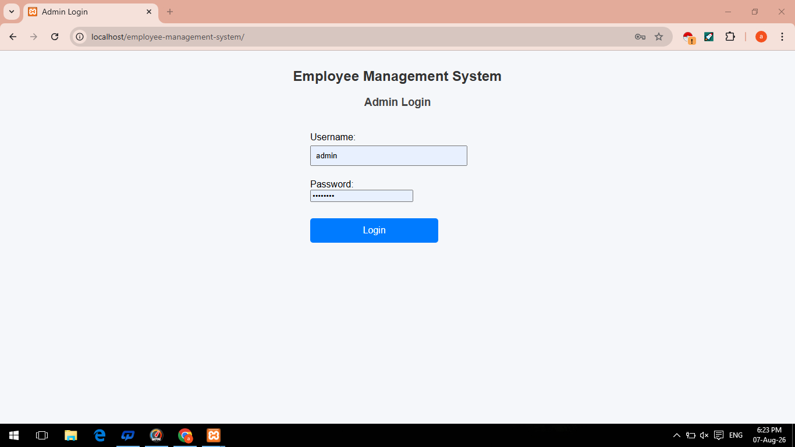
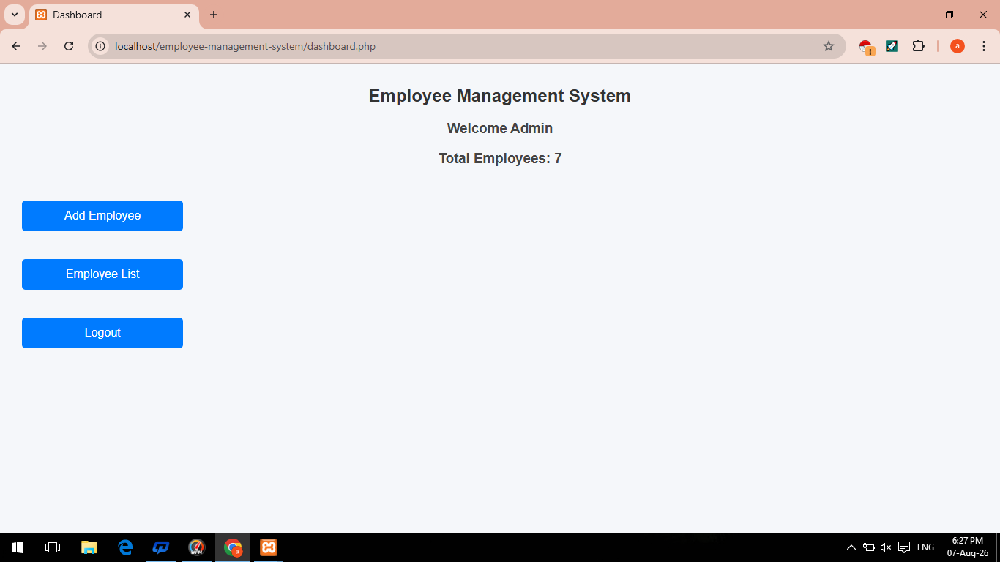
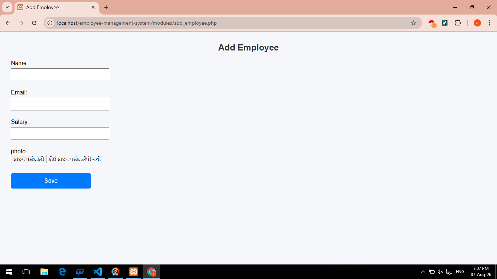
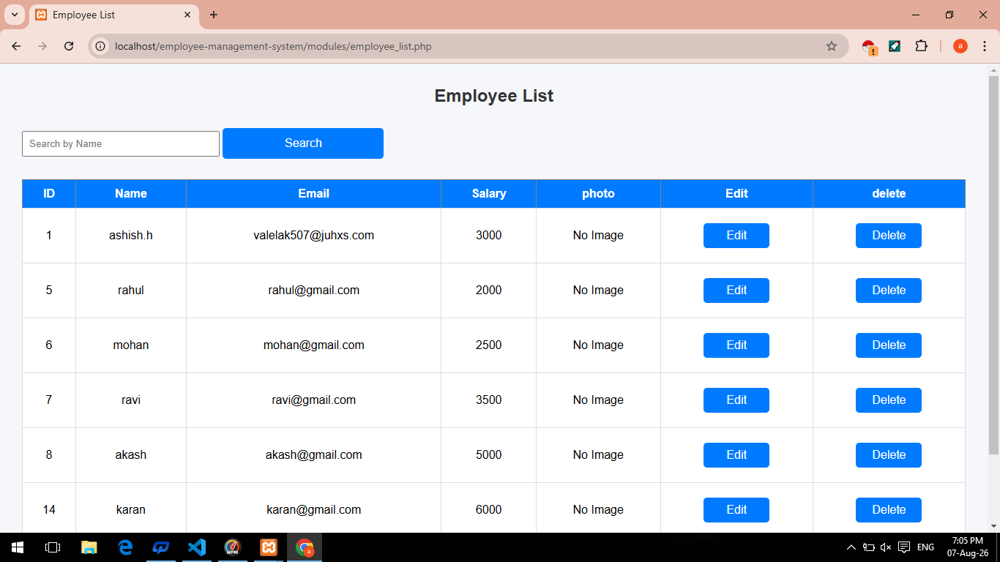

# Employee Management System

A web-based Employee Management System developed using PHP and MySQL.

This system allows an administrator to manage employee records through a simple and user-friendly interface.

## Project Description

This project provides basic employee management functionality such as adding, viewing, searching, editing, and deleting employee records.

It also supports employee photo upload and stores employee information in a MySQL database.

## Features

- Admin Login
- Admin Dashboard
- Add Employee
- Employee List
- Search Employee by Name
- Edit Employee
- Delete Employee
- Employee Photo Upload
- No Image handling when photo is unavailable
- MySQL Database Integration
- Delete Confirmation

## Technologies Used

- PHP
- MySQL
- HTML
- CSS
- JavaScript
- XAMPP
- phpMyAdmin

## Project Structure

employee-management-system/
│
├── assets/
│   ├── css/
│   ├── image/
│   └── js/
│
├── config/
│   └── db.php
│
├── database/
│   └── employee_management.sql
│
├── includes/
│
├── modules/
│   ├── add_employee.php
│   ├── delete_employee.php
│   ├── edit_employee.php
│   └── employee_list.php
│
├── screenshots/
│   ├── add-employee.png
│   ├── admin-login.png
│   ├── dashboard.png
│   └── employee-list.png
│
├── uploads/
│
├── dashboard.php
├── index.php
├── logout.php
└── README.md

## Database Setup

1. Start Apache and MySQL from XAMPP.

2. Open phpMyAdmin.

3. Create a database named:

employee_management

4. Import the SQL file:

database/employee_management.sql

5. Check the database connection settings in:

config/db.php

## How to Run the Project

1. Copy the project folder into:

C:\xampp\htdocs\

2. Start Apache and MySQL in XAMPP.

3. Open the project in your browser:

http://localhost/employee-management-system/

4. Login using the configured admin credentials.

## Screenshots

### Admin Login

### Dashboard

### Add Employee

### Employee List

## Employee Management

The Employee List provides:

- Employee information
- Search functionality
- Employee photo
- Edit option
- Delete option

If an employee does not have a valid photo, the system displays:

No Image

## Security & Validation

The project includes basic handling for:

- Login authentication
- Employee record management
- Photo availability checking
- Delete confirmation
- Database connectivity

## CRUD Operations

The system supports the following CRUD operations:

- Create - Add new employee
- Read - View employee records
- Update - Edit employee information
- Delete - Remove employee records

## Project Purpose

This project was developed as a practical PHP/MySQL project to demonstrate:

- Database management
- CRUD operations
- PHP and MySQL integration
- File upload handling
- Basic authentication
- Web application development

## Author

Ashish Chaudhary